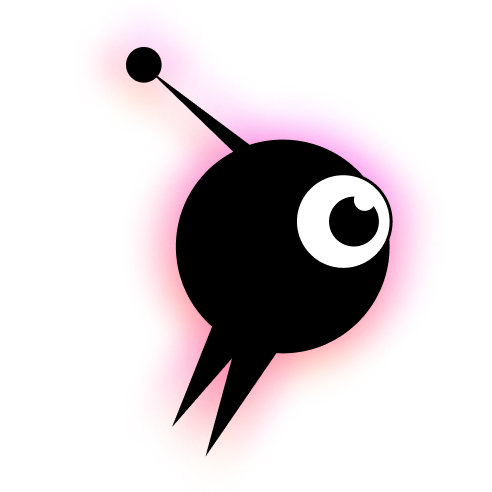
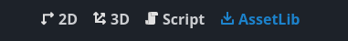
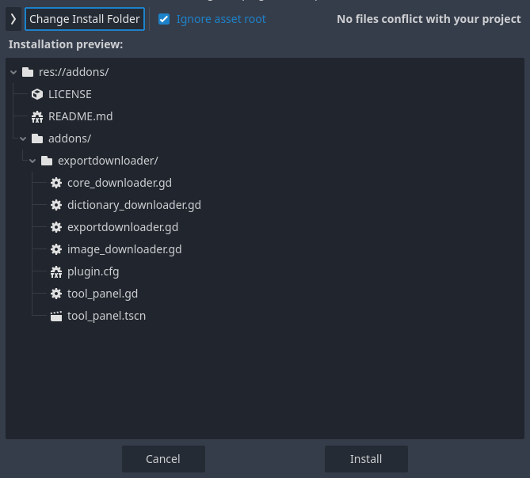
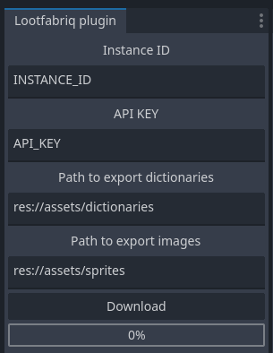

# Lootfabriq Godot plugin

Godot Plugin for [Lootfabriq](https://lootfabriq.io/). This plugin allows you to seamlessly download the latest exported dictionaries and images from the Lootfabriq CMS directly into your Godot project

## Installation

Use Godot's `AssetLib` and search for `Lootfabriq export downloader` and click _Install_

Check _Ignore asset root_ is enabled

Choose `res://addons/` directory as an installation dir for your project and click `Install`

In Godot, locate to Project -> Project Settings -> Plugins, and enable `Lootfabriq export downloader`

On the left side of the Godot editor, you should see the plugin panel

Please check out the [documentation](https://docs.lootfabriq.io/how-to/download-json-and-images-docker/#finding-and-using-your-api-token-instance-id-and-report-id) to know how to obtain the *INSTANCE_ID* and *API_KEY*.

## An alternative installation

You may download plugin ZIP directly from [Releases](https://github.com/lootfabriq/godot-plugin/releases) page

Go to `AssetLib`, click `Import`, and select downloaded ZIP file, then follow Import instruction
